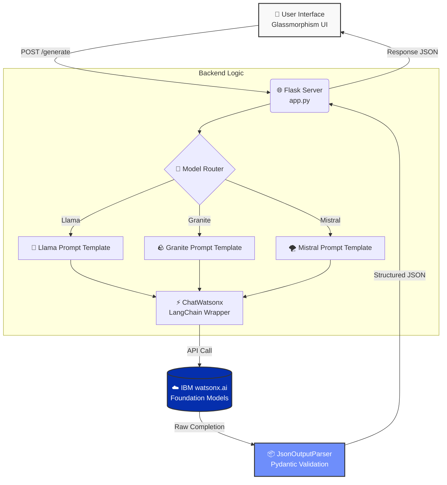
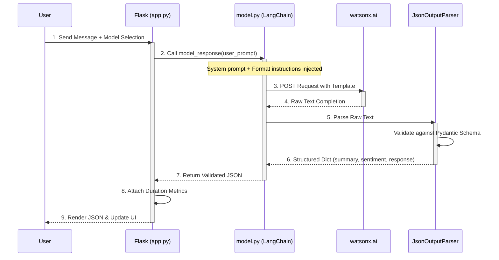

---

### 🚀 Updated README.md (Copy-Paste this full text)

```markdown
# 🧠 AI Assistant – Multi-Model Chat with LangChain & IBM watsonx

[](https://www.python.org/)
[](https://flask.palletsprojects.com/)
[](https://www.langchain.com/)
[](https://www.ibm.com/watsonx)
[](https://opensource.org/licenses/MIT)

---

## 🎥 Demo Video

<!-- Option 1: Auto-playing MP4 (Upload your video as 'demo.mp4' in the root folder) -->
<div align="center">
  <video src="./demo.mp4" width="100%" controls autoplay loop muted></video>
  <br/>
  <i>⚡ A quick walkthrough of the AI Assistant in action — switching between Llama, Granite, and Mistral.</i>
</div>

<!-- Option 2: Clickable Badges (If you uploaded to YouTube or LinkedIn) -->
<p align="center">
  <a href="https://www.linkedin.com/feed/update/your_share_id_here/">
    
  </a>
  <a href="https://youtu.be/your_video_id">
    
  </a>
</p>

---

## ✨ Key Features

- 🤖 **Multi-Model Agnostic**: Seamlessly switch between 3 leading models (`meta-llama/llama-4-maverick`, `ibm/granite-4-h-small`, `mistralai/mistral-small-3-1`).
- 📊 **Structured JSON Output**: Enforces strict schema validation using Pydantic + LangChain's `JsonOutputParser`. No more raw, unpredictable text.
- 🔮 **Sentiment & Summarization**: Every response is accompanied by a sentiment score (0–100) and a concise user query summary.
- 🖼️ **Glassmorphism UI**: Self-contained, modern frontend with smooth animations, loaders, and mobile responsiveness.
- ⚙️ **Modular Codebase**: `config.py`, `model.py`, and `app.py` are separated for maintainability and easy scaling.
- 🚀 **Skills Network Ready**: Pre-configured to run instantly in IBM's Cloud IDE with zero API key setup (for lab environments).

---

## 🏗️ System Architecture

The application follows a layered architecture where the frontend communicates with Flask, which routes requests to LangChain orchestration, finally hitting the watsonx inference endpoint.



---

## 🔄 Data Flow (Sequence Diagram)



---

## 🛠️ Tech Stack

| Layer | Technology | Purpose |
| :--- | :--- | :--- |
| **Frontend** | HTML5 + CSS3 (Glassmorphism) + Vanilla JS | Self-contained interactive UI. |
| **Backend** | Flask (Python 3.11+) | REST API routing and session handling. |
| **Orchestration** | LangChain (`1.3.11`) | Prompt templating, model abstraction, and chaining. |
| **LLM Interface** | `langchain-ibm` + `ibm-watsonx-ai` | Wrapper for IBM watsonx inference API. |
| **Validation** | Pydantic (`2.5.0`) | Data validation and schema enforcement. |
| **Deployment** | IBM Skills Network / Cloud IDE | Pre-configured for instant deployment. |

---

## 📂 Project Structure

```
genai_flask_app/
├── app.py                 # Flask routes & main server entry
├── model.py               # LangChain model init, templates & parsers
├── config.py              # Model IDs, generation parameters (greedy, tokens)
├── llm_test.py            # Sanity check script to test all models CLI
├── requirements.txt       # Python dependencies
├── demo.mp4               # Demo video (optional, for README)
├── templates/
│   └── index.html         # Single-page Glassmorphism UI
├── static/
│   ├── script.js          # Interactive frontend logic
│   └── styles.css         # Modern glass aesthetic
└── README.md              # This file
```

---

## 🚀 Getting Started (Local Development)

Follow these steps to run the project on your local machine or cloud environment.

### 1. Prerequisites
- Python 3.11 or higher.
- An IBM Cloud account with access to **watsonx.ai**.
- Your **Project ID** and **API Key** from IBM Cloud.

### 2. Clone the Repository
```bash
git clone https://github.com/your-username/ai-assistant-langchain.git
cd ai-assistant-langchain
```

### 3. Set up Virtual Environment
```bash
python -m venv venv
source venv/bin/activate  # On Windows: venv\Scripts\activate
```

### 4. Install Dependencies
```bash
pip install -r requirements.txt
```

### 5. Configure Environment Variables (Critical for Local)
Create a `.env` file in the root directory:
```env
WATSONX_API_KEY=your-ibm-cloud-api-key-here
WATSONX_PROJECT_ID=your-watson-studio-project-id-here
```

**Update `model.py`** to read these variables:
```python
import os
from dotenv import load_dotenv
load_dotenv()

def initialize_model(model_id):
    return ChatWatsonx(
        model_id=model_id,
        url="https://us-south.ml.cloud.ibm.com",
        project_id=os.getenv("WATSONX_PROJECT_ID"),  # Changed from hardcoded
        params=PARAMETERS
    )
```

> **Note for Skills Network Users:** If running in IBM Skills Network, you can ignore the `.env` step. The IDE injects keys automatically and the hardcoded `project_id="skills-network"` works perfectly.

### 6. Run the Application
```bash
python app.py
```
Navigate to `http://localhost:5000` in your browser.

---

## 📡 API Reference

### `POST /generate`

Generate an AI response with structured metadata.

**Request Body (JSON):**
```json
{
  "message": "Your prompt here",
  "model": "llama"  // Options: "llama", "granite", "mistral"
}
```

**Response (JSON):**
```json
{
  "summary": "The user asks about the capital of Canada.",
  "sentiment": 90,
  "response": "The capital of Canada is Ottawa. It is known for the Rideau Canal.",
  "duration": 1.42
}
```

| Field | Type | Description |
| :--- | :--- | :--- |
| `summary` | `string` | Concise summary of the user's query. |
| `sentiment` | `int` | Score 0 (negative) to 100 (positive). |
| `response` | `string` | The AI-generated reply to the user. |
| `duration` | `float` | API response time in seconds. |

---

## 🎨 UI Preview


> *The frontend features a blurred glass effect, animated gradient background, floating orbs, and real-time loading indicators.*

---

## 🧪 Testing All Models (CLI)

Run `llm_test.py` to compare outputs across all three models without starting the web server:

```bash
python llm_test.py
```

This will print raw structured JSON responses for Llama, Granite, and Mistral side-by-side, allowing easy performance/quality comparisons.

---

## 🤝 Contributing

We welcome contributions! Please follow these steps:
1. Fork the repository.
2. Create a feature branch (`git checkout -b feature/amazing-feature`).
3. Commit your changes (`git commit -m 'Add some amazing feature'`).
4. Push to the branch (`git push origin feature/amazing-feature`).
5. Open a Pull Request.

---

## 📄 License

Distributed under the MIT License. See `LICENSE` for more information.

---

## 🙏 Acknowledgements

- **IBM Skills Network** – For providing the cloud IDE environment and watsonx credits.
- **LangChain Community** – For the incredible orchestration framework.
- **Hailey Quach, Kang Wang, Faranak Heidari** – Original lab authors at IBM.
- **IBM Bob** – The AI coding assistant that helped streamline best practices during development.

---

## 🔗 Connect with Me

- LinkedIn: https://www.linkedin.com/in/rana-umer-05a9a9359/

---

⭐ **If you found this project helpful, please give it a star on GitHub!**
```
